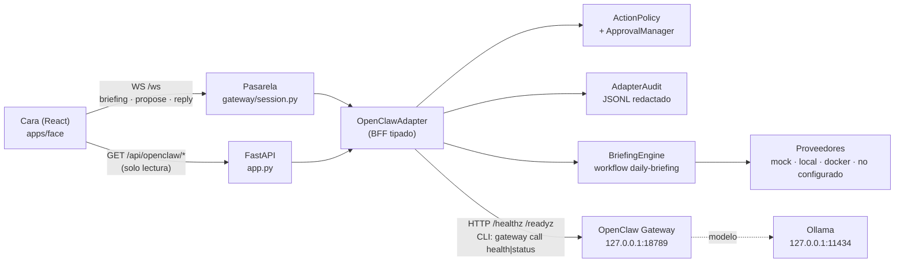
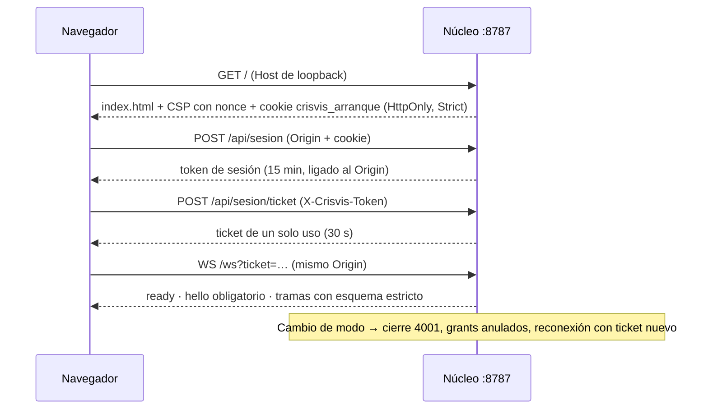

# Arquitectura CRISVIS + OpenClaw

## Principio

La cara (UI) **nunca** habla con OpenClaw. Todo pasa por un único adaptador
tipado dentro del núcleo Python: `OpenClawAdapter` (`src/crisvis/openclaw/`).
El adaptador es el BFF: valida, aplica la política, audita y decide qué puede
salir de CRISVIS.

Accesos prohibidos por diseño (y cubiertos por pruebas):

| Prohibido | Cómo se impide |
|---|---|
| Frontend → OpenClaw | La cara solo conoce `/ws` y `/api/openclaw/*` del núcleo. OpenClaw exige token, que la cara no tiene. El middleware de origen rechaza orígenes ajenos (403) y Hosts que no son de loopback (421); el WebSocket exige ticket y `/api/*` exige token de sesión. `connect-src` de la CSP no incluye el puerto 18789. |
| LLM → shell | El informe no pasa por el modelo; los disparadores se resuelven antes (`triggers.py`). `local.py` solo ejecuta argv fijos con `shell=False`. No hay `executeAnything`. |
| LLM → credenciales | El adaptador no lee el token de OpenClaw; la CLI oficial lo lee de su propio archivo. Las salidas pasan por `redact()`. |
| LLM → write/delete/send sin política | Toda acción es una `ProposedAction` contra un registro cerrado (`tools.py`) que evalúa `ActionPolicy`. Con `DRY_RUN=true` nada sale. |
| Prompt crudo → OpenClaw | El adaptador no expone ningún método que envíe texto libre a OpenClaw. Solo `health`/`status`. |

## Módulos

| Módulo | Responsabilidad |
|---|---|
| `contracts.py` | Modelos pydantic estrictos (`extra="forbid"`): `DailyBriefingRequest/Result`, `ConnectorResult`, `ProposedAction` (con huella sha256), `ApprovalRequest`, `AuditEvent`, enums de riesgo, alerta, estado y modo. |
| `tools.py` | Registro cerrado de ~35 herramientas con su nivel de riesgo (READ_ONLY…CRITICAL). Lo que no está aquí se bloquea. |
| `policy.py` | `ActionPolicy.evaluate(acción, modo)` → ALLOW / APPROVE / BLOCK + `simulate`. Riesgo efectivo = máximo entre el registrado y el declarado. |
| `approvals.py` | Aprobaciones de un solo uso, con caducidad y ligadas a la huella exacta de la acción (`hmac.compare_digest`). |
| `audit.py` + `redact.py` | Auditoría JSONL en `<home>/auditoria-adaptador.jsonl`, redactada (tokens, claves, JWT, rutas). |
| `ratelimit.py` | Límite de informes por minuto (ventana deslizante). |
| `workflow.py` + `workflows/daily-briefing.toml` | Flujo declarativo. El esquema exige `acciones_externas = false` y `dry_run = true`. |
| `triggers.py` | «Buenos días», «Informe del día», «CRISVIS, dame mi informe», «¿Qué tengo hoy?» → nivel de detalle. No secuestra frases con otras peticiones. |
| `briefing.py` | Motor: fuentes en paralelo, timeout por fuente y global, alertas por reglas, cancelación, auditoría. |
| `summary.py` | Resumen hablado en castellano para el TTS existente. |
| `providers/` | `MockProvider` (10 fuentes deterministas), `LocalSystemProvider` y `DockerProvider` (reales, solo lectura), `NotConfiguredProvider`. |
| `gateway.py` | Cliente de OpenClaw: solo loopback, sondas HTTP y CLI con métodos `{health, status}`. Los shims `.cmd` se resuelven a `node openclaw.mjs` (nunca `cmd.exe`). |
| `adapter.py` | Fachada única: informe, refresco por fuente, estado de conectores, gateway, política, aprobaciones, ejecución (simulada), auditoría. |

## Flujo del informe diario

1. La cara envía `ask` con «Informe del día» (o pulsa INFORME).
2. `Session.ask` detecta el disparador y **no** llama al modelo; lanza
   `_run_briefing` como trabajo cancelable.
3. El adaptador comprueba el límite de frecuencia, construye la petición
   (zona America/Lima, detalle, timeouts) y la valida.
4. `BriefingEngine` consulta las fuentes en paralelo; cada una con su timeout
   (6 s) y todas con el global (20 s). Cada resultado sale como trama
   `briefing/source` en cuanto llega.
5. Reglas del TOML → alertas CRITICAL/HIGH/MEDIUM/LOW/INFO.
6. Trama `briefing/done` con el resultado completo, y `text`/`done` con el
   resumen hablado (lo lee el TTS existente).
7. Auditoría: `briefing.request`, `briefing.source` × N, `briefing.done`
   con `external_actions: 0`.

`interrupt` (Stop) cancela el trabajo: las fuentes pendientes quedan
`cancelled` y se emite `briefing/cancelled`.

## Flujo de una acción propuesta

1. Un proveedor adjunta `ProposedAction` (p. ej. borrador de respuesta).
2. La cara envía `propose {id}`.
3. Política: BLOCK → `outcome: blocked`. ALLOW → ejecuta (simulado).
   APPROVE → trama `approval` con servicio/cuenta, acción, destino,
   parámetros exactos, contenido, impacto, huella y caducidad.
4. El usuario pulsa Aprobar o Denegar (Esc deniega; Intro y voz no aprueban).
   La respuesta incluye la huella; si no coincide, se rechaza.
5. `consume()` gasta la aprobación (un solo uso) y ejecuta. Con `DRY_RUN`
   el resultado es `simulated`: «no se ha hecho nada fuera de CRISVIS».
6. Siempre se audita (`policy` y `action`) y se envía `outcome`.

## Protocolo (packages/protocol/frames.json, versión 2)

- Cliente → núcleo: `hello` (siempre la primera), `ask` (con `source`:
  `voz`, `voz_activacion`, `teclado`, `boton`), `interrupt`, `briefing`
  (`status` | `refresh` | `audit`), `propose`, `reply` (respuesta a
  `approval` o a una confirmación, con `grant` y `nonce`).
- Núcleo → cliente: además de las del asistente (`ready`, `status`, `text`,
  `tool`, `done`, `confirm`…), `briefing` (fases `start`, `source`, `done`,
  `cancelled`, `error`, `status`, `audit`), `approval`, `outcome`, `input`
  (entrada aceptada o rechazada) y `cancel` (`requested`, `cancelled`,
  `failed`). El modo vigente viaja en `status`.
- Retirada en la versión 2: la trama `permissions`. Si un cliente la envía, se
  rechaza y se audita, igual que cualquier campo que decida el núcleo (modo,
  riesgo, aprobación, identidad, sesión).

HTTP (todo con `X-Crisvis-Token` salvo `/health` y medios):
`GET /api/openclaw/estado`, `GET /api/openclaw/auditoria?limite=N`,
`GET /api/openclaw/informe`.

## Autenticación de la cara (Fase 3.5)

El modo de permisos vive en el núcleo (`security/modes.py`). LIBRE solo llega
desde la CLI (`/api/admin/*`, con `admin.token` y sin Origin). Cada acción del
control del PC pasa por `security/guard.py` (riesgo por acción y secuencia) y
por `security/grants.py` (aprobación individual con nonce). Detalle en
`SECURITY_MODEL.md` y `HARDENING_REPORT.md`.

## Procesos y puertos

| Proceso | Puerto | Escucha en | Arranque |
|---|---|---|---|
| Núcleo CRISVIS (FastAPI + cara) | 8787 | 127.0.0.1 | `npm start` |
| Servicio de voz CRISVIS | 8788 | 127.0.0.1 | lo lanza el núcleo |
| Ollama | 11434 | 127.0.0.1 | servicio de Ollama |
| OpenClaw Gateway | 18789 | 127.0.0.1 | manual: `openclaw gateway run --port 18789 --bind loopback` |

OpenClaw **no** está instalado como servicio (sin Tarea programada). Si no
está corriendo, el adaptador lo muestra como «detenido» y el informe funciona
igual: OpenClaw no es necesario para el MVP. Se ve en la pestaña Integraciones.

## Configuración (`crisvis.toml`, sección `[openclaw]`)

`habilitado`, `dry_run` (true; `DRY_RUN=true` en el entorno solo puede
activarlo), `gateway_url` (solo loopback), `cli`, `usuario`, `zona_horaria`,
`detalle`, `fuentes`, `timeout_global`, `timeout_fuente`, `simular_fallos`,
`permitir_bajo`, `critico_habilitado`, `segundos_aprobacion`,
`max_informes_por_minuto`.
