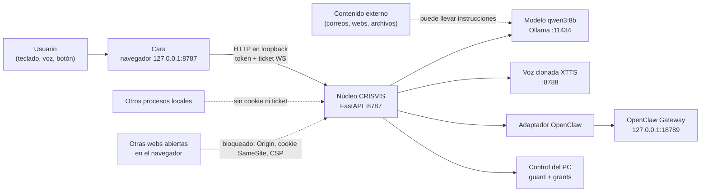

# Modelo de amenazas — CRISVIS (Fase 3.5)

Alcance: un solo equipo Windows, un solo usuario, todo en loopback. Sin
cuentas reales conectadas. Complementa `SECURITY_MODEL.md` (reglas) y
`RISK_REGISTER.md` (estado de cada riesgo).

## Activos

| Activo | Por qué importa |
|---|---|
| Control del PC (teclado, ratón, abrir programas, shell) | Equivale a ejecutar código como el usuario |
| Modo de permisos | Decide qué se ejecuta sin preguntar |
| Portapapeles, pantalla, cámara, micrófono | Datos personales y secretos copiados |
| Archivos del usuario | `file_read` / `file_write` |
| Claves (ElevenLabs, futuros OAuth), token del Gateway de OpenClaw | Coste, acceso a cuentas |
| Auditoría y telemetría | Evidencia; no deben contener secretos ni texto |
| Disponibilidad (GPU, Ollama, voz) | Uso diario |

## Componentes y fronteras

Fronteras de confianza: navegador ↔ núcleo (HTTP/WS en loopback), núcleo ↔
modelo (el modelo **no** es de confianza), núcleo ↔ PC (toda acción pasa por
`guard.py`), núcleo ↔ OpenClaw (solo health/status, argv fijos).

## Actores

| Actor | Capacidad | Dentro del alcance |
|---|---|---|
| Web maliciosa abierta en el navegador | Peticiones cross-site, DNS rebinding, WebSocket hacia 127.0.0.1 | Sí |
| Contenido externo con inyección de prompt | Influir en lo que el modelo pide hacer | Sí |
| Modelo que se equivoca o alucina | Pedir herramientas con parámetros dañinos | Sí |
| Audio ambiente, eco o reconocedor de voz | Crear entradas que nadie dijo | Sí (incidente «como») |
| Proceso local sin privilegios del mismo usuario | Leer archivos del usuario, imitar el navegador | **Parcial**: se documenta, no se puede impedir |
| Administrador local o malware con privilegios | Todo | No |
| Red externa | Nada escucha fuera de loopback | Sí (verificado) |

## Amenazas (STRIDE) y controles

| # | Amenaza | Categoría | Control | Riesgo residual |
|---|---|---|---|---|
| T1 | Una web abre `ws://127.0.0.1:8787/ws` y manda órdenes | Spoofing | Origin obligatorio, ticket de un solo uso ligado a Origin, token de sesión que solo obtiene la página servida por el núcleo (cookie HttpOnly SameSite=Strict) | Bajo |
| T2 | DNS rebinding contra la API | Spoofing | Host de loopback obligatorio (421) | Bajo |
| T3 | Una web llama a `/tts` o `/api/mcp/recargar` | Tampering, DoS | Token en cabecera (no se puede mandar cross-site sin CORS), Origin ajeno 403, límites 429, confirmación «RECARGAR» | Bajo |
| T4 | El modelo encadena Win+R → `cmd` → Intro | Elevation | `guard.py` bloquea la secuencia como CRITICAL; aprobación por acción con nonce | Bajo |
| T5 | El modelo pide abrir `powershell.exe` o un `.ps1` | Elevation | `pc_open` bloquea shells, intérpretes y ejecutables fuera de `apps_permitidas` | Bajo |
| T6 | Una aprobación se reutiliza para otra acción | Tampering | Grant de un solo uso: huella de parámetros, turno, ventana, nonce, 60 s | Bajo |
| T7 | El cliente se sube a LIBRE | Elevation | La trama `permissions` se rechaza; `POST /api/permisos` solo baja; LIBRE solo por CLI con `admin.token` y frase | Bajo |
| T8 | LIBRE se queda activo olvidado | Elevation | Caduca (≤ 30 min), no persiste, vuelve a CONFIRMAR al reiniciar | Bajo |
| T9 | Lectura silenciosa del portapapeles | Information disclosure | `read_clipboard` HIGH, aprobación cada vez, enmascarado, fuera de logs, desactivable | Bajo |
| T10 | Un XSS en la cara ejecuta código o exfiltra | Information disclosure | CSP con nonce, sin `unsafe-eval` ni `unsafe-inline` en scripts, `connect-src` cerrado | Bajo (`style-src 'unsafe-inline'`) |
| T11 | Clickjacking de la ventana de aprobación | Tampering | `frame-ancestors 'none'`, `X-Frame-Options: DENY` | Bajo |
| T12 | Una orden aprobada por error no se puede parar | DoS, Tampering | Stop termina el job object o el árbol de procesos; aviso previo si no es cancelable | Bajo (`pc_*` no cancelables) |
| T13 | Entrada fantasma por voz | Spoofing | Telemetría de entradas, turno visible solo tras aceptación, filtro de palabra suelta, «sí» por voz no aprueba HIGH | Bajo |
| T14 | Secretos en logs, auditoría o telemetría | Information disclosure | `redact()`, filtro de tickets en logs de acceso, HMAC en vez de texto | Bajo (escáner de OpenJarvis) |
| T15 | Gasto en ElevenLabs | DoS (económico) | Desactivado salvo `elevenlabs_habilitado = true`; token y límite por minuto | Bajo |
| T16 | OpenClaw expuesto o con canales | Spoofing, Elevation | `bind: loopback`, sin canales, skills, hooks ni webhooks; el adaptador solo usa argv fijos | Bajo |
| T17 | Un proceso local lee `admin.token` y activa LIBRE | Elevation | Archivo en `<home>` del usuario; LIBRE caduca y queda auditado | **Aceptado**: el mismo proceso ya puede actuar como el usuario |
| T18 | `file_read`/`file_write` fuera de carpetas esperadas | Information disclosure, Tampering | Pendiente (R-18) | Medio |
| T19 | Servidores MCP heredan el entorno | Information disclosure | Pendiente (R-19) | Medio |

## Supuestos

- El equipo y la cuenta de Windows del usuario no están comprometidos.
- El navegador aplica correctamente CSP, SameSite y CORS.
- Nada escucha fuera de loopback (verificado con `Get-NetTCPConnection`).
- El usuario lee la ventana de confirmación antes de aprobar.

## Fuera de alcance

Malware con los privilegios del usuario o de administrador, acceso físico,
ataques a Ollama o a los modelos en sí, y la cadena de suministro de
dependencias ya instaladas (tratada aparte en `OPENCLAW_AUDIT.md` §9).
